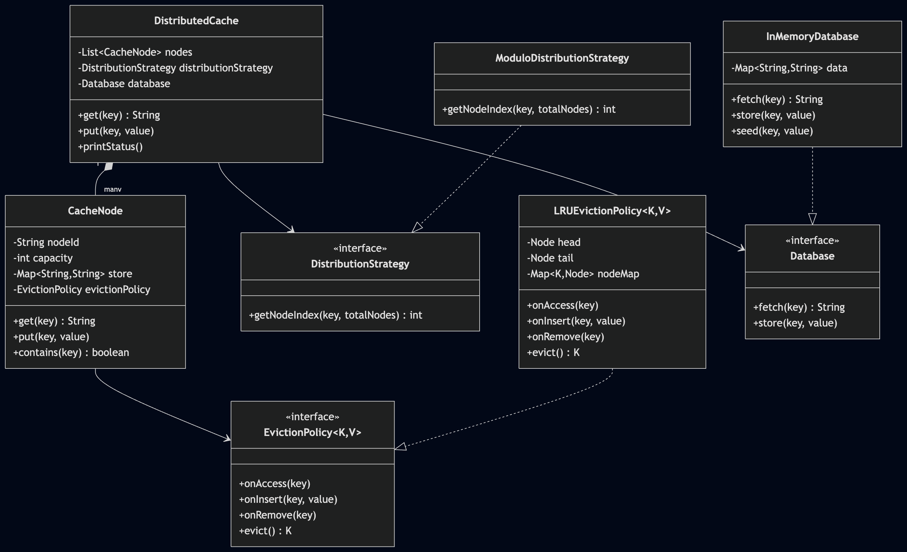

# Distributed Cache System

An object-oriented distributed cache in Java with pluggable distribution strategy, pluggable eviction policy, and database fallback on cache miss.

---

## APIs

| Method | Description | Returns |
|--------|-------------|---------|
| `get(key)` | Returns cached value; on miss, fetches from DB and caches it | `String` |
| `put(key, value)` | Stores in cache node + writes through to database | void |

---

## How Data is Distributed

Keys are routed to cache nodes using a **pluggable DistributionStrategy**.

Current implementation: **Modulo-based** — `hash(key) % numberOfNodes`.

The strategy interface allows swapping in consistent hashing or any custom routing without changing the cache logic.

---

## How Cache Miss is Handled

1. `get(key)` checks the target cache node
2. If **HIT** — return the cached value
3. If **MISS** — fetch from the `Database`, store the result in the cache node, then return it

---

## How Eviction Works

Each `CacheNode` has a fixed capacity. When a node is full and a new key arrives:

1. The `EvictionPolicy.evict()` is called to pick the victim key
2. The victim is removed from the node's store
3. The new entry is inserted

Current implementation: **LRU (Least Recently Used)** — uses a doubly-linked list + HashMap for O(1) access and eviction.

---

## Extensibility

| Extension Point | Interface | Current Impl | Future Options |
|----------------|-----------|--------------|----------------|
| Distribution | `DistributionStrategy` | `ModuloDistributionStrategy` | Consistent hashing, map-based routing |
| Eviction | `EvictionPolicy<K,V>` | `LRUEvictionPolicy` | LFU, MRU, FIFO |
| Database | `Database` | `InMemoryDatabase` | JDBC, Redis, any backing store |

---

## Class Diagram



---

## How to Run

```bash
cd distributed-cache/src
javac *.java
java Main
```
