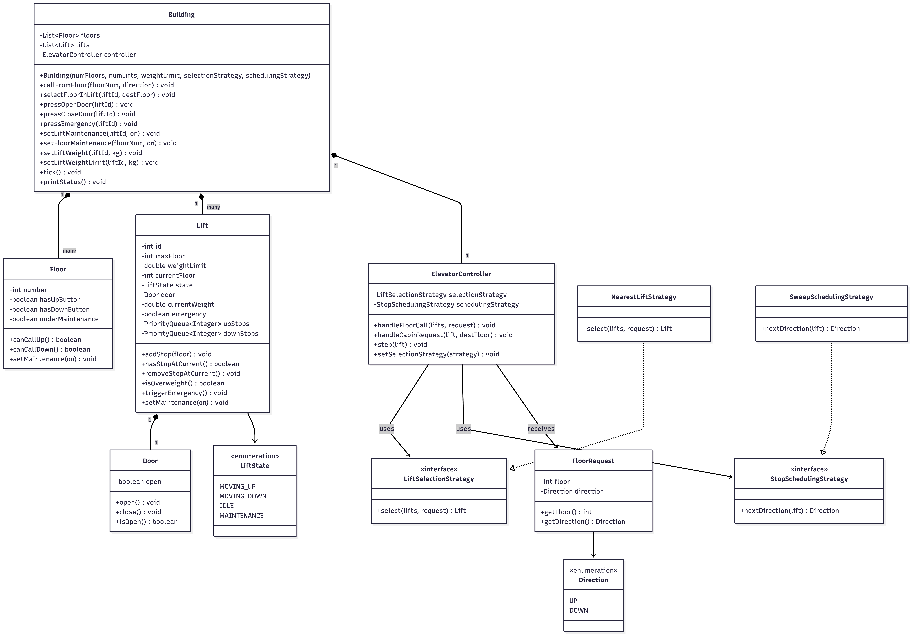

# Elevator System

A scalable, object-oriented multi-lift system in Java that models real-world elevator behavior. The design separates input handling, request routing, and physical execution for clean abstractions and extensibility.

---

## Design Philosophy

The system is built around a clear separation of concerns:

* **Input Layer (Building facade):** Captures user interactions — floor calls, cabin buttons, open/close, emergency
* **Control Layer (ElevatorController):** Routes requests to the most suitable lift using pluggable strategies
* **Execution Layer (Lift):** Handles movement, door operations, weight checks, and state

---

## Core Features

### Button Handling

* **External buttons (UP/DOWN):** Available on every floor via `Building.callFromFloor()` — controls all carts
* **Internal floor buttons:** Via `Building.selectFloorInLift()` — controls that specific cart only
* **Open/Close door buttons:** Via `Building.pressOpenDoor()` / `pressCloseDoor()`
* **Emergency button:** Via `Building.pressEmergency()` — that particular elevator stops and rings an alarm
* Ground floor has no DOWN button; top floor has no UP button

### Lift State Management

Lift states are modeled using an enum:

* `MOVING_UP`
* `MOVING_DOWN`
* `IDLE` (on a particular floor)
* `MAINTENANCE`

State is updated dynamically during each simulation step.

### Pluggable Strategy Pattern

Two key decisions are abstracted behind strategy interfaces — swappable without modifying existing code:

1. **`LiftSelectionStrategy`** — Which lift to send for a floor request
   * Default: `NearestLiftStrategy` (picks closest non-maintenance lift)
2. **`StopSchedulingStrategy`** — In what order a lift serves its stops
   * Default: `SweepSchedulingStrategy` (SCAN algorithm — continue in current direction, then reverse)

### Weight Handling

* Each cart has its own weight limit (default 700 kg, variable per cart)
* When overweight: elevator stops, door opens, alarm is played
* Managed via `Building.setLiftWeight()` and `Building.setLiftWeightLimit()`

### Emergency Handling

* Triggered via internal emergency button
* Immediately halts the elevator (state → MAINTENANCE)
* Opens doors and prints alarm

### Maintenance

* **Lift maintenance:** `Building.setLiftMaintenance()` — no jobs assigned to that lift
* **Floor maintenance:** `Building.setFloorMaintenance()` — disables UP/DOWN buttons on that floor

### Multi-Lift Coordination

* Managed by `ElevatorController`
* Assigns exactly one elevator per request
* Uses pluggable strategies for decision-making

---

## System Flow

```
User → Building (button press)
         ↓
   ElevatorController (strategies)
         ↓
   Assigned Lift
         ↓
   Movement + Safety checks
```

---

## Architecture Overview

### Responsibility Separation

| Concern | Class |
|---------|-------|
| Movement + safety logic | `ElevatorController.step()` |
| Stop scheduling | `StopSchedulingStrategy` |
| Lift selection | `LiftSelectionStrategy` |
| Floor constraints | `Floor` |
| User-facing API | `Building` |

### Extensibility

The system supports:
* New lift selection strategies (e.g., load-based, zone-based)
* Alternative scheduling algorithms (e.g., FCFS, LOOK)
* Additional safety mechanisms
* New operational modes

---

## Class Diagram



---

## How to Run

```bash
cd elevator-system/src
javac *.java
java Main
```
