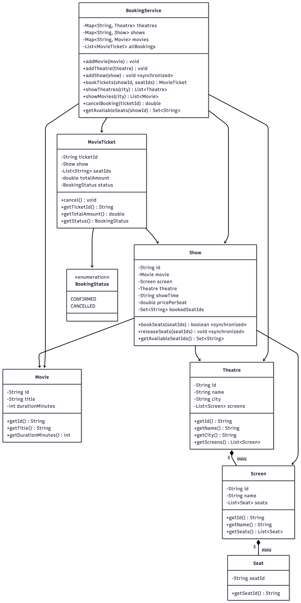

# Movie Ticket Booking System

An object-oriented movie ticket booking system in Java with concurrency-safe seat booking, cancellation with refund, and admin show management.

---

## APIs

| Method | Description | Returns |
|--------|-------------|---------|
| `bookTickets(showId, seats)` | Books the given seats for a show | `MovieTicket` |
| `showTheatres(city)` | Lists all theatres in a city | `List<Theatre>` |
| `showMovies(city)` | Lists all movies playing in a city | `List<Movie>` |
| `cancelBooking(ticketId)` | Cancels booking, releases seats, processes refund | refund amount |
| `addShow(show)` | Admin adds a new show (synchronized) | void |
| `getAvailableSeats(showId)` | Lists available seats for a show | `Set<String>` |

---

## Concurrency Handling

- **Seat booking:** `Show.bookSeats()` is `synchronized` — atomically checks all requested seats and books them. Two threads racing for the same seats: exactly one wins, the other fails.
- **Admin show addition:** `BookingService.addShow()` is `synchronized` — prevents duplicate show IDs when multiple admins add shows concurrently.

---

## Key Design Decisions

- **Entities:** `Movie`, `Theatre`, `Screen`, `Seat`, `Show`, `MovieTicket`
- **Show owns seat state:** Each `Show` has its own `Set<String> bookedSeatIds` — different shows on the same screen have independent bookings
- **Atomic booking:** All-or-nothing — if any requested seat is taken, the entire booking fails
- **Cancellation:** Marks ticket as `CANCELLED`, releases seats back, returns refund amount
- **Double cancel protection:** Second cancel on same ticket is rejected

---

## Class Diagram



---

## How to Run

```bash
cd movie-ticket-booking/src
javac *.java
java Main
```
