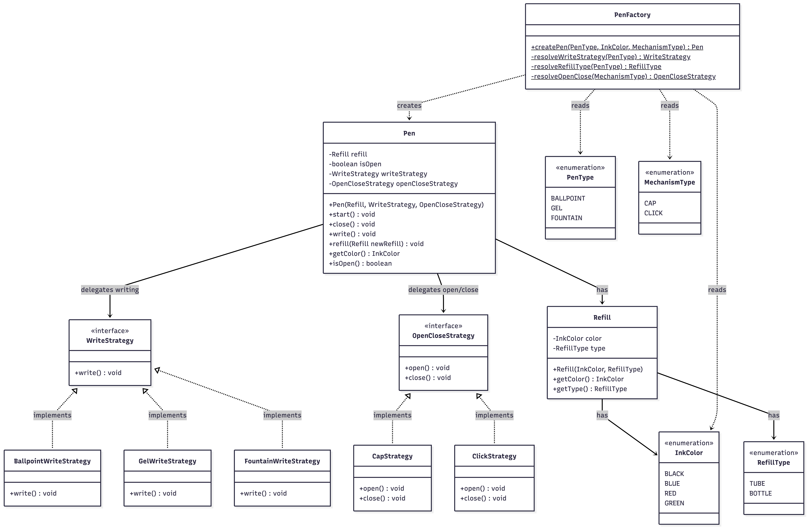

# Pen

A clean, object-oriented implementation of a Pen system in Java, designed with a strong focus on modularity and SOLID principles.

## System Design & Architecture

This application models real-world pen behavior into distinct software entities, ensuring high extensibility for adding new pen types or mechanisms.

* **Strategy Pattern:** The core behaviors of the pen — writing and open/close mechanism — are abstracted into interfaces (`WriteStrategy`, `OpenCloseStrategy`). This allows flexible behavior composition without modifying the `Pen` class (Open/Closed Principle).
* **Factory Pattern:** The `PenFactory` handles the complexity of creating properly configured pen objects, mapping `PenType` and `MechanismType` enums to the correct strategy implementations.
* **Refill as a First-Class Object:** Instead of storing color as a plain string, the `Refill` class encapsulates both `InkColor` and `RefillType`, making color changes type-safe and allowing the refill mechanism to carry its own metadata.
* **State Management:** The pen tracks whether it is open or closed and throws `IllegalStateException` when `write()` is called before `start()`.

## Class Diagram



## Core Entities

| Class | Responsibility |
|-------|---------------|
| `Pen` | Central class — holds a `Refill`, a `WriteStrategy`, and an `OpenCloseStrategy`. Enforces start/close lifecycle. |
| `Refill` | Encapsulates ink color and refill type. Swappable to change pen color. |
| `PenFactory` | Creates fully configured `Pen` instances from `PenType`, `InkColor`, and `MechanismType`. |
| `WriteStrategy` | Interface for writing behavior. |
| `BallpointWriteStrategy` | Smooth ballpoint writing. |
| `GelWriteStrategy` | Thick gel ink writing. |
| `FountainWriteStrategy` | Elegant fountain nib writing. |
| `OpenCloseStrategy` | Interface for pen activation mechanism. |
| `CapStrategy` | Remove/put cap to open/close. |
| `ClickStrategy` | Click button to extend/retract nib. |
| `InkColor` | Enum: BLACK, BLUE, RED, GREEN. |
| `PenType` | Enum: BALLPOINT, GEL, FOUNTAIN. |
| `MechanismType` | Enum: CAP, CLICK. |
| `RefillType` | Enum: TUBE, BOTTLE. |

## Pen Rules

- Before writing, the pen must be opened via `start()`.
- After writing, the pen should be closed via `close()`.
- Writing on a closed pen throws an `IllegalStateException`.
- Each pen has one color at a time, determined by its `Refill`.
- Color can be changed by swapping the refill with `refill(newRefill)`.
- Pens can be either cap-based or click-based (determined at creation).
- Different pen types (ballpoint, gel, fountain) have different writing styles and refill types.

## How to Run

```bash
cd src
javac *.java
java Main
```

### Sample Output
```
Error: Cannot write! Pen is closed. Call start() first.

Clicking the button to extend the nib.
[BLUE] Writing with thick, dark gel ink.
Clicking the button to retract the nib.

-------------------

Removing the cap.
[BLACK] Writing elegantly with a fountain ink nib.
Refilled pen with RED BOTTLE refill.
[RED] Writing elegantly with a fountain ink nib.
Putting the cap back on.
```
