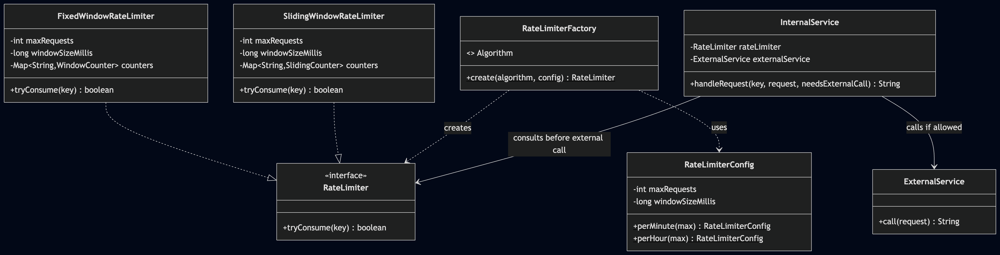

# Pluggable Rate Limiting System

A rate limiting module for external resource usage in Java. Rate limiting is applied only when the system is about to call a paid external API — not on incoming client requests.

---

## APIs

| Method | Description | Returns |
|--------|-------------|---------|
| `RateLimiter.tryConsume(key)` | Checks if the external call is allowed for the given key | `boolean` |
| `InternalService.handleRequest(key, request, needsExternalCall)` | Processes request; checks rate limiter only if external call is needed | `String` |

---

## How It Works

```
Client Request → InternalService → Business Logic
                                      ↓
                              Needs external call?
                             /                    \
                           No                     Yes
                            ↓                      ↓
                    Return local result    RateLimiter.tryConsume(key)
                                          /                         \
                                       Allowed                   Denied
                                         ↓                         ↓
                                  Call ExternalService     Return rate limit error
```

---

## Key Design Decisions

- **Rate limiting at external call point, not at API entry** — only calls that actually consume paid resources are rate limited
- **Per-key isolation** — each key (customer, tenant, API key) has its own independent quota
- **Pluggable algorithms via Strategy Pattern** — `RateLimiter` interface with swappable implementations
- **Factory for algorithm selection** — `RateLimiterFactory.create(algorithm, config)` lets callers switch without changing business logic
- **Thread-safe** — each key's counter uses `synchronized` blocks; `ConcurrentHashMap` for key-level concurrency

---

## Algorithm Trade-offs

| | Fixed Window | Sliding Window |
|---|---|---|
| **How it works** | Divides time into fixed intervals, resets counter each interval | Weighted average of current + previous window counts |
| **Memory** | O(1) per key (one counter) | O(1) per key (two counters) |
| **Accuracy** | Can allow 2x burst at window boundary | Smooths out boundary bursts |
| **Complexity** | Simplest to implement | Slightly more complex (weighted calculation) |
| **Best for** | Simple use cases, non-critical limits | Production systems needing smoother rate control |

---

## Extensibility

| Extension Point | Interface | Current Impl | Future Options |
|----------------|-----------|--------------|----------------|
| Algorithm | `RateLimiter` | `FixedWindowRateLimiter`, `SlidingWindowRateLimiter` | Token Bucket, Leaky Bucket, Sliding Log |
| Config | `RateLimiterConfig` | `perMinute()`, `perHour()` | Custom windows, burst allowances |
| Key strategy | `String key` param | customer/tenant/apiKey | Composite keys, hierarchical limits |

---

## Class Diagram



---

## How to Run

```bash
cd rate-limiter/src
javac *.java
java Main
```
