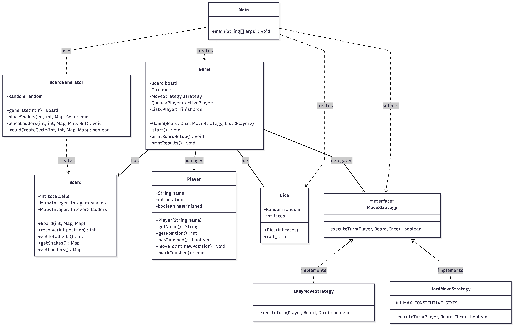

# Snake and Ladder

A clean, object-oriented implementation of the classic Snake and Ladder game in Java, designed with a strong focus on modularity and SOLID principles.

## System Design & Architecture

This application models the physical game board into distinct software entities, ensuring high extensibility for future rule changes.

* **Strategy Pattern:** Player movement and win conditions are abstracted into a `MoveStrategy` interface. This allows seamless toggling between "Easy" and "Hard" game modes without modifying the core `Game` loop (Open/Closed Principle).
* **Builder/Generator Pattern:** The `BoardGenerator` encapsulates random placement of snakes and ladders with built-in cycle detection, keeping the board construction logic isolated from the game logic.
* **Single Responsibility:** Domain entities (`Board`, `Player`, `Dice`) maintain only their specific states. The `Board` solely resolves positions via `Map<Integer,Integer>` lookups, while the `Game` class orchestrates the turn-based queue.

## Class Diagram



## Core Entities

| Class | Responsibility |
|-------|---------------|
| `Game` | Manages the round-robin player queue, coordinates turns, and tracks finish rankings. |
| `Board` | Stores snakes and ladders as `Map<Integer,Integer>` for O(1) position resolution. |
| `BoardGenerator` | Randomly places `n` snakes and `n` ladders on the board with cycle prevention. |
| `Player` | Tracks individual player name, current position, and finished state. |
| `Dice` | Generates randomized roll values for a configurable number of faces. |
| `MoveStrategy` | Interface defining how a turn is executed. |
| `EasyMoveStrategy` | Single dice roll per turn. |
| `HardMoveStrategy` | Extra turns on rolling a 6; forfeits turn after three consecutive 6s. |
| `Main` | Entry point — reads board size (`n`), number of players, and difficulty from user via `Scanner`. |

## Game Rules

- The board has numbers from `1` to `n²`.
- Players move turn-by-turn, starting at position `0` (outside the board).
- A six-sided dice gives a random number from `1` to `6`.
- Landing on a snake head sends the player down to the snake's tail.
- Landing on a ladder bottom sends the player up to the ladder's top.
- If a move would go beyond `n²`, the player stays in place.
- The game continues until only one player remains (all others have finished).
- Snakes and ladders are placed randomly and do not create cycles.

### Difficulty Modes

| Mode | Behavior |
|------|----------|
| **Easy** | One roll per turn. Simple and straightforward. |
| **Hard** | Rolling a `6` grants an extra turn. Three consecutive `6`s forfeit the entire turn. |

## How to Run

```bash
cd src
javac *.java
java Main
```

### Sample Input
```
Enter board dimension n (board will be n x n): 10
Enter number of players: 3
Enter name for Player 1: Alice
Enter name for Player 2: Bob
Enter name for Player 3: Charlie
Enter difficulty level (easy/hard): hard
```
